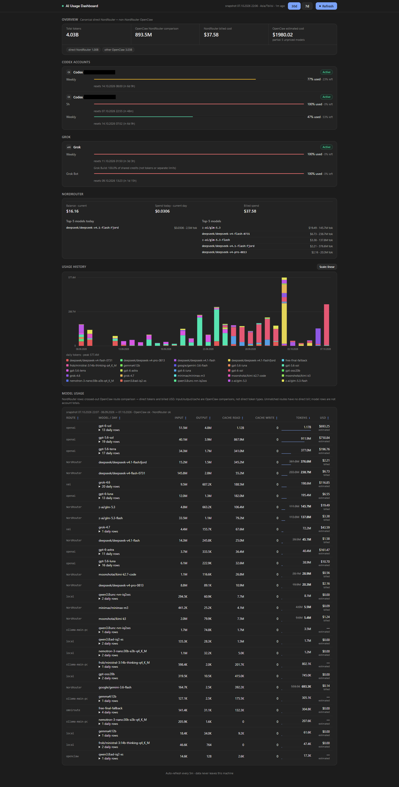

# AI Usage Dashboard (local web edition)

A private, self-hosted web dashboard for AI usage, quota windows, model breakdowns, and estimated cost. **This local edition is based on [grapeot/ai_usage_dashboard](https://github.com/grapeot/ai_usage_dashboard)**; that upstream project supplied the original aggregation and charting foundation. This repository adds the locally deployed FastAPI web UI and integrations described below. It is not affiliated with the providers whose data it reads.



The screenshot above is from the running local web dashboard. Only the two account email labels were covered with opaque masks; the rest of the original screenshot is unchanged.

## What it shows

- Overview: token totals, direct NordRouter tokens, OpenClaw tokens, and estimated/billed cost.
- Provider quotas: separate Codex profiles, Cursor, GLM/Z.ai, Claude, Ollama, Antigravity, Grok, and Grok Bot when configured or available.
- NordRouter: balance, spend windows, and top models from its account API.
- Usage history and model usage: 7-day or 30-day view combining OpenClaw Gateway model-day data with direct NordRouter account-day data. Direct NordRouter spend is canonical; Gateway-routed NordRouter rows remain comparison-only to avoid double counting.
- Terminal table and optional desktop matplotlib chart from `auto_usage.py`.

Missing/unknown values stay unavailable rather than being shown as zero. Collection reads local logs/caches and configured provider APIs; it does not upload usage data to a dashboard cloud service.

## Run locally

Requires Python 3.11+, `uv`, and Node/npm for Codex `ccusage` exports.

```bash
git clone https://github.com/dankarization/ai-usage-dashboard-local.git
cd ai-usage-dashboard-local
cp .env.example .env
uv venv .venv
uv pip install --python .venv/bin/python -e '.[dev]'
scripts/ai-usage-service
```

Open `http://127.0.0.1:7995/` or `/dashboard`. The page is self-contained and uses no CDN. `scripts/ai-usage-service` defaults to loopback on port 7995; configure `AI_USAGE_HOST` and `AI_USAGE_PORT` privately if another device needs access. On this deployment, a user systemd service runs `local_display_service:app` from this checkout on port 7995.

`cp .env.example .env` creates a private, ignored configuration file. Enable only sources you use. Local Codex, Claude Code, and OpenCode logs need no API key. Optional variables include `CODEX_HOME_2` and profile labels, `CURSOR_COOKIE`, `GLM_BEARER_TOKEN`, `GROK_COOKIE`, `OLLAMA_COOKIE`, `NORDROUTER_API_KEY`, `OPENCODE_BATCH_DB`, and `AI_USAGE_OPENCODE_SKILL_PATH`. Never commit credentials or generated exports.

For a terminal report or desktop chart:

```bash
scripts/ai-usage -d 7
scripts/ai-usage -d 30 --skip-desktop-chart
```

The collector writes a private `token_usage_eink.json` cache used by the web service (a legacy filename, not a hardware requirement). The optional chart is `token_usage_dashboard.png`. Both are gitignored.

## Web/API contract

| Endpoint | Purpose |
| --- | --- |
| `GET /` or `/dashboard` | Web dashboard |
| `GET /health` | Service liveness |
| `GET /token_usage.json` | Cached full dashboard payload |
| `GET /api/v1/quotas` | Cache-only provider quota windows |
| `GET /api/v1/model-breakdown?days=7&daily=true` | Model and daily usage; `days=30` is the default |
| `POST /api/v1/display/update` | Serialized full refresh; the page uses it on open, every five minutes, and on Refresh |
| `POST /api/v1/antigravity/ingest` | Optional cross-machine Antigravity entry ingest |

The page shares a 7d/30d selector across overview, history, and model usage. Quota reset windows and today's NordRouter figures retain their own periods. `GET /api/v1/quotas` does not force a provider refresh; it uses the in-memory or on-disk cache. Response models and field descriptions are defined in `dashboard_models.py` and available at `/openapi.json`. `scripts/push-antigravity` can send local entries from a separately configured satellite machine.

## Verification and privacy

```bash
.venv/bin/python -m pytest tests/ -v
.venv/bin/python -c "import tomllib; tomllib.load(open('pyproject.toml','rb'))"
curl -fsS http://127.0.0.1:7995/health
```

`.env`, local source exports, dashboard payloads, charts, caches, logs, and temporary files are ignored. The committed screenshot contains no account email addresses or image metadata. The unredacted original is not part of this repository. The historical `eink/` firmware and simulator from upstream are not used by this web deployment and have been removed from the current tree; the cache/API names remain for compatibility with the live UI.

See [docs/test.md](docs/test.md) for focused service checks and [skills/skill_ai_usage_dashboard.md](skills/skill_ai_usage_dashboard.md) for local agent operations.
